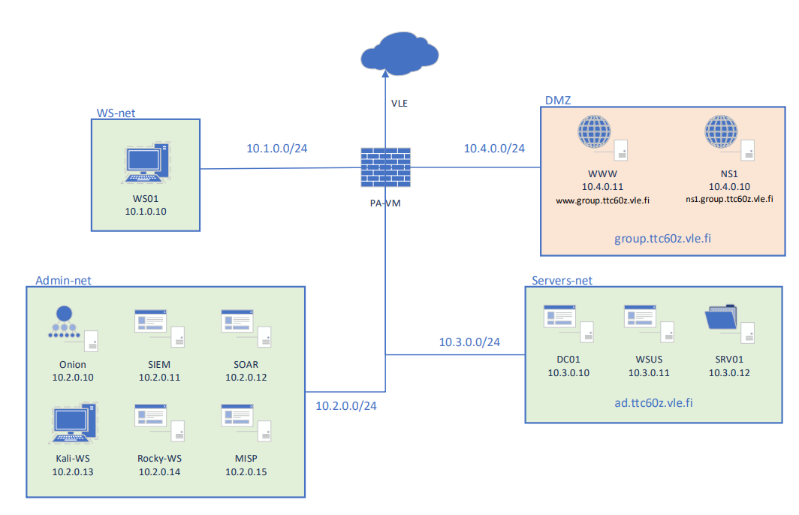

## Kyberpuolustus Moduuli info

Tämä moduuli sisältää projekteja, jotka on toteutettu osana JAMK Ammattikorkeakoulun kyberturvallisuuden koulutusohjelmaa. Projektit keskittyvät kyberturvallisuuden keskeisiin osa-alueisiin, joiden avulla kehitetään osaamista kyberuhkien havaitsemisessa, niiden torjunnassa ja tietoturvan hallinnassa.

Kaikki tehtävät on suoritettu kuvitteellisen yrityksen DefendByVirtual VLE ympäristöön, joka on kuvattu alla

#### Aihealueet

- **Kyberpuolustus**: Menetelmät ja strategiat, joiden avulla organisaatioita voidaan suojata kyberuhilta.
- **Koventaminen**: Järjestelmien ja verkkojen suojaaminen vähentämällä hyökkäyspinta-alaa.
- **Kyberuhkatieto**: Uhkatiedon kerääminen ja analysointi tietoturvariskien tunnistamiseksi ja hallitsemiseksi.
- **Kyberturvallisuuden hallinta**: Tietoturvan johtaminen ja riskienhallinta organisaatiotasolla.
- **Tietoturvakontrollit**: Keskeiset tietoturvatoimenpiteet ja -ratkaisut järjestelmien suojauksessa.
- **SOC (Security Operations Center)**: Reaaliaikainen seuranta ja analysointi, joka mahdollistaa kyberuhkien nopean tunnistamisen ja reagoinnin.
- **Poikkeamien hallinta**: Prosessit ja menetelmät tietoturvaloukkausten havaitsemiseksi ja käsittelemiseksi.

Moduulin tehtävät ja harjoitukset on suunniteltu tukemaan kyberturvallisuuden kokonaisvaltaista osaamista ja antamaan opiskelijalle käytännön valmiuksia turvallisuuden hallintaan ja kehittämiseen.
